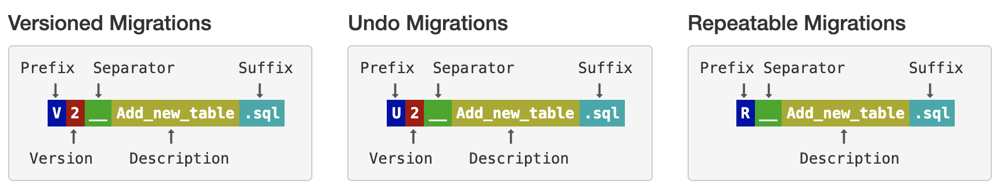

# BQtools

Versioned or repeatable data definition statements on BigQuery.


## Define Migrations
SQL migrations must be put under `migrations` directory and comply with the following naming pattern in order to be picked up by BQtools.


The naming pattern was inspired by [Flywaydb](https://flywaydb.org/documentation/migrations).

### Versioned Migrations
The most common type of migration is a versioned migration. Each versioned migration has a version, a description and a checksum. The version must be unique. The description is purely informative for you to be able to remember what each migration does. The checksum is there to detect accidental changes. Versioned migrations are applied in order exactly once.

Versioned migrations are typically used for:
* Creating/altering/dropping
* Reference data updates
* User data corrections

### Undo Migrations
Undo migrations are the opposite of regular versioned migrations. An undo migration is responsible for undoing the effects of the versioned migration with the same version. Undo migrations are optional and not required to run regular versioned migrations.

### Repeatable Migrations
Repeatable migrations have a description, but no version. Instead of being run just once, they are (re-)applied every time their checksum changes. This is very useful for managing database objects whose definition can then simply be maintained in a single file in version control. Repeatable migrations are always applied last. They are typically used for:
* (Re-)creating
* Bulk reference data reinserts

> **Note:** Datasets cannot be created/deleted through migrations. BigQuery does not support that at the moment. You have to create a dataset manually or using Gcloud `bq` command before deploying your schema. Dataset cloud location must be same as the one specified in the app through an environment variable. Default locations is `australia-southeast1`.

---

## Setup Prerequisites
* [Pyenv](https://github.com/pyenv/pyenv) version manager
* [Poetry](https://python-poetry.org/) packaging and dependency manager
* [Direnv](https://direnv.net/) for loading environment variables
* [Gcloud](https://cloud.google.com/sdk/) tools and libraries for interacting with Google Cloud

## Setup

### Internal Repository Credentials

Store the credentials of nexus internal repository. If you do not specify the password, you will be prompted to enter.
```
❯ poetry config http-basic.bueno <username> <password>
```

### Python Versions

Install the application-specific Python versions (defined in `.python-version` file).
```
❯ pyenv install
```

### Dependencies and Virtual Environment

Install all the dependencies. Poetry has been configured to create virtual environment inside the project's root directory under `.venv` if there is no one.
```
❯ poetry install
```

> **Note:**  You may need to set Python interpreter as `.venv/bin/python` in your editor if the packages are still unresolved.

### Environment Variables

Make a copy of `.envrc.example` as `.envrc` file in root directory and set variables. Then, load as below:
```
❯ direnv allow .
```

> **Important Note:** `GOOGLE_CLOUD_LOCATION` must not be changed after any migration. Run another app instance for different locations.

Application default credentials can be acquired by the command below. Do not set/export `GOOGLE_APPLICATION_CREDENTIALS` if you want to use the credentials generated by this command in your local development.
```
❯ gcloud auth application-default login
```

## Run

Run the app and tests like so:

```
❯ poetry run migrate
```
```
❯ poetry run test
```

## Additional Help

### Set Python Versions

Set the local application-specific Python versions into `.python-version`.
```
❯ pyenv local 3.8.2 3.7.7
```

### Add Dependencies

Add more dependencies from external or internal repos.
```
❯ poetry add pybueno
❯ poetry add pendulum@^2.0.5
```

### Define Commands

The Poetry run command will execute the given command inside the project's virtualenv.
```
❯ poetry run python -V
Python 3.8.2
```

A new custom command can be defined under `[tool.poetry.scripts]` in `pyproject.toml` file as below:
```
[tool.poetry.scripts]
my-script = "my_module:main"
```
You can execute it like so:
```
❯ poetry run my-script
```

### Poetry Help

Check out Poetry [docs](https://python-poetry.org/docs/) or execute:
```
❯ poetry -h
```
